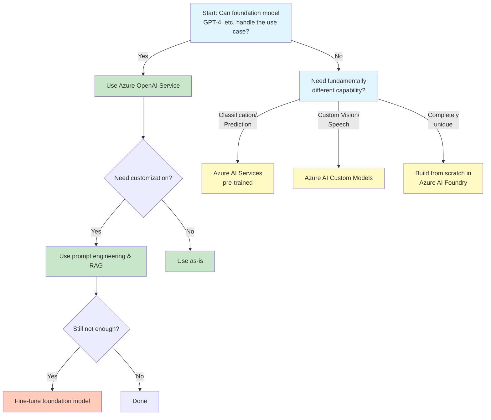

# Domain 1: Plan AI-Powered Business Solutions (25-30%)

## Overview
This domain focuses on analyzing requirements, designing AI strategies, and evaluating costs/benefits for AI-powered business solutions. It's the foundation for successful AI solution architecture.

## Study Topics

This domain is organized into separate detailed guides:

1. **[Analyze Requirements for AI-Powered Business Solutions](plan/01-analyze-requirements.md)**
   - Assess the use of agents in task automation, data analytics, and decision-making
   - Review data for grounding (accuracy, relevance, timeliness, cleanliness, availability)
   - Organize business solution data for AI systems

2. **[Design Overall AI Strategy](plan/02-ai-strategy-design.md)**
   - Implement AI adoption process from Cloud Adoption Framework
   - Design strategy for building AI and agents
   - Design multi-agent solutions across platforms
   - Include Microsoft AI Center of Excellence elements

3. **[Prebuilt Agents and Custom Models](plan/03-agents-and-models.md)**
   - Use cases for prebuilt agents (M365, Dynamics 365, Power Platform)
   - When to build custom agents vs extend Microsoft 365 Copilot
   - When to create custom AI models
   - Prompt library guidelines
   - Small language models for specific use cases
   - Prompt engineering guidelines and techniques

4. **[ROI and Cost Evaluation](plan/04-roi-cost-evaluation.md)** _(Coming Soon)_
   - Select ROI criteria for AI-powered business solutions
   - Create ROI analysis for proposed solutions
   - Build vs. buy vs. extend analysis
   - Implement model router for cost optimization

---

## Quick Reference

---

## Section 1: Analyze Requirements for AI-Powered Business Solutions

### 1.1 Assess the Use of Agents

#### Agent Types and Their Applications
**Task Automation Agents:**
- Execute specific, repeatable business processes
- Examples: Invoice processing, appointment scheduling, data entry
- Best for: Well-defined workflows with clear start/end points
- Characteristics: Rule-based logic with AI enhancement

**Data Analytics Agents:**
- Process and analyze large datasets
- Generate insights and reports
- Predict trends and patterns
- Examples: Sales forecasting, customer sentiment analysis, demand prediction

**Decision-Making Agents:**
- Provide recommendations based on data analysis
- Support complex business decisions
- Examples: Loan approval assistants, inventory optimization agents
- Combine: Historical data + real-time inputs + business rules

#### Assessment Criteria
✅ **When to Use Agents:**
- Repetitive tasks consuming significant time
- Processes requiring 24/7 availability
- Tasks needing consistent quality
- Scenarios with large data volumes
- Operations requiring rapid response times

❌ **When NOT to Use Agents:**
- Tasks requiring high emotional intelligence
- Processes with unclear requirements
- Situations demanding human judgment on ethical matters
- One-time or rarely executed tasks

### 1.2 Review Data for Grounding

#### Data Quality Dimensions

**Accuracy:**
- Data must be correct and free from errors
- Validation: Cross-reference with authoritative sources
- Impact: Inaccurate data leads to hallucinations and poor decisions
- Actions: Implement data validation rules, regular audits

**Relevance:**
- Data must align with the specific use case
- Context matters: Industry-specific, role-specific, time-specific
- Avoid: Including irrelevant data that confuses the model
- Best practice: Curate knowledge sources carefully

**Timeliness:**
- Data must be current and up-to-date
- Consider: Product catalogs, pricing, policies, regulations
- Stale data risks: Outdated recommendations, compliance issues
- Solution: Implement data refresh schedules

**Cleanliness:**
- Remove duplicates, inconsistencies, formatting issues
- Standardize: Date formats, naming conventions, units
- Handle: Missing values, outliers, contradictions
- Tools: Data profiling, cleansing pipelines

**Availability:**
- Data must be accessible when needed
- Consider: Security permissions, API rate limits, network latency
- Plan for: Backup sources, caching strategies
- Ensure: Proper connectors and authentication

#### Data Organization Best Practices
```
Structured Approach:
1. Centralize knowledge in SharePoint, Dataverse, or Azure Storage
2. Implement metadata tagging for easy retrieval
3. Create semantic models for relationships
4. Version control for data changes
5. Access controls aligned with business roles
```

### 1.3 Organize Business Solution Data for Other AI Systems

#### Data Interoperability Strategies

**Standardized Formats:**
- Use industry-standard formats (JSON, XML, Parquet)
- Implement schema definitions
- Document data structures clearly

**API Design:**
- RESTful APIs for data access
- GraphQL for complex queries
- Real-time data with webhooks or SignalR
- Authentication: OAuth 2.0, Managed Identities

**Integration Patterns:**
- Agent2Agent (A2A) protocol for agent communication
- Model Context Protocol (MCP) for model interactions
- Microsoft Graph for M365 data
- Dataverse for Power Platform data

**Data Governance:**
- Data catalogs for discoverability
- Lineage tracking for data origins
- Quality metrics and monitoring
- Compliance with data regulations

---

## Section 2: Design Overall AI Strategy for Business Solutions

### 2.1 Implement AI Adoption Process from Cloud Adoption Framework

#### Cloud Adoption Framework (CAF) - AI Strategy

**Phase 1: Strategy**
- Define business objectives for AI
- Identify key stakeholders
- Assess organizational readiness
- Set success metrics and KPIs

**Phase 2: Plan**
- Digital estate assessment
- Skills readiness plan
- Cloud adoption plan with AI initiatives
- Cost modeling and budgeting

**Phase 3: Ready**
- Azure landing zones setup
- Environment configuration (Dev, Test, Prod)
- Identity and access management
- Network topology for AI workloads

**Phase 4: Adopt**
- Start with pilot projects
- Iterative development approach
- Migrate existing solutions to AI-powered versions
- Build new AI-native solutions

**Phase 5: Govern**
- Policy enforcement for AI use
- Cost management and optimization
- Security and compliance monitoring
- Responsible AI governance

**Phase 6: Manage**
- Operations management baseline
- Performance monitoring
- Continuous improvement
- Change management

### 2.2 Design Strategy for Building AI and Agents

#### Agentic-First Approach
**Principles:**
1. **Agent as Primary Interface:** Design workflows around conversational agents
2. **Human-in-the-Loop:** Agents augment, not replace human decision-making
3. **Composable Architecture:** Build reusable agent components
4. **Continuous Learning:** Agents improve from user interactions

**Agent Architecture Patterns:**
```
Single Agent: Simple use cases, one agent handles entire workflow
├── Example: FAQ bot, simple data lookup

Multi-Agent Orchestrated: Complex workflows, specialized agents
├── Example: Sales process with lead qualification, proposal, and follow-up agents
├── Orchestrator: Coordinates agent interactions
└── Specialized Agents: Each handles specific domain

Hierarchical Agents: Parent-child relationships
├── Example: Main customer service agent delegates to billing, technical, account agents
└── Escalation paths: From child to parent when needed

Collaborative Agents: Peer-to-peer interaction
├── Example: Sales and Marketing agents share customer insights
└── Communication: Agent2Agent (A2A) protocol
```

### 2.3 Design Multi-Agent Solutions

#### Platform Selection

**Microsoft 365 Copilot:**
- Use case: Productivity enhancement, knowledge work
- Strengths: Native M365 integration, user context awareness
- Extension: Declarative agents, plugins, Graph connectors
- Best for: Enterprise-wide general productivity

**Microsoft Copilot Studio:**
- Use case: Custom business process agents
- Strengths: Low-code development, enterprise connectors
- Features: Topics, actions, generative AI orchestration
- Best for: Department-specific or process-specific agents

**Azure AI Foundry:**
- Use case: Custom AI models, advanced scenarios
- Strengths: Full development control, model fine-tuning
- Features: Prompt flow, model catalog, evaluation tools
- Best for: Specialized industry models, complex AI requirements

#### Integration Strategy
```
Hybrid Approach:
┌─────────────────────────────────────────┐
│        User Interface Layer              │
│  (Teams, SharePoint, Custom Apps)        │
└──────────────────┬──────────────────────┘
                   │
┌──────────────────┴──────────────────────┐
│     Orchestration Layer                  │
│  - Microsoft 365 Copilot (General)       │
│  - Copilot Studio (Process-Specific)     │
└──────────────────┬──────────────────────┘
                   │
┌──────────────────┴──────────────────────┐
│     Intelligence Layer                   │
│  - Azure AI Foundry (Custom Models)      │
│  - Azure OpenAI (Foundation Models)      │
│  - Azure AI Services (Specialized AI)    │
└──────────────────┬──────────────────────┘
                   │
┌──────────────────┴──────────────────────┐
│        Data Layer                        │
│  - Dataverse, SharePoint, Azure Storage  │
└──────────────────────────────────────────┘
```

### 2.4 Use Cases for Prebuilt Agents

#### Microsoft 365 Agents
- **Sales Agent (M365 Copilot for Sales):** CRM integration, email insights, meeting prep
- **Service Agent (M365 Copilot for Service):** Case management, knowledge base access
- **Project Management:** Task tracking, timeline analysis, resource allocation
- **Data Analysis:** Excel data insights, trend identification

#### Dynamics 365 Agents
- **Customer Service:** Automated case routing, knowledge article suggestions
- **Sales:** Lead scoring, opportunity insights, quote generation
- **Field Service:** Scheduling optimization, resource dispatching
- **Finance:** Invoice processing, expense analysis, forecasting

#### Power Platform Agents
- **AI Builder Prebuilt Models:** Form processing, object detection, sentiment analysis
- **Template Agents:** Industry-specific starting points

**Decision Framework:**
```
Use Prebuilt Agent When:
✓ Use case matches prebuilt functionality (80%+ overlap)
✓ Limited customization budget/time
✓ Standard industry processes
✓ Need rapid deployment

Build Custom Agent When:
✓ Unique business processes
✓ Competitive differentiation required
✓ Complex integrations needed
✓ Specific industry compliance requirements
```

### 2.5 Solution Rules and Constraints

#### Copilot Studio Constraints
- **Topic Limits:** Maximum nodes per topic
- **Session Duration:** Timeout settings for conversations
- **API Call Limits:** Rate limiting on connectors
- **Data Volume:** Size limits for knowledge sources
- **Concurrent Users:** Licensing-based limitations

#### Azure AI Services Constraints
- **Token Limits:** Maximum tokens per request (varies by model)
- **Rate Limits:** Requests per minute/hour
- **Regional Availability:** Not all services in all regions
- **Quota Management:** Subscription-level quotas

#### Azure AI Foundry Constraints
- **Compute Resources:** GPU availability for model training
- **Storage Limits:** Model size and dataset size restrictions
- **Deployment Limits:** Number of concurrent endpoints
- **Cost Considerations:** Training and inference costs

#### Best Practices for Working with Constraints
1. **Design for Limits:** Build with batching, caching, pagination
2. **Error Handling:** Graceful degradation when limits reached
3. **Monitoring:** Track usage against limits proactively
4. **Optimization:** Reduce unnecessary API calls, optimize prompts
5. **Escalation:** Plan for when automation fails

### 2.6 Generative AI and Knowledge Sources in Copilot Studio

#### Knowledge Source Types

**SharePoint:**
- Documents, pages, lists
- Automatic indexing
- Respects permissions
- Best for: Corporate policies, procedures, internal wikis

**OneDrive:**
- Personal or shared files
- Version control integration
- Best for: Individual expert knowledge, working documents

**Dataverse:**
- Structured business data
- Real-time updates
- Relationship awareness
- Best for: CRM data, operational data, transactional records

**Public Websites:**
- External content indexing
- URL-based ingestion
- Best for: Public product info, industry resources

**Custom Data Sources (via MCP):**
- APIs and databases
- Real-time data retrieval
- Best for: Legacy systems, external services

#### Generative AI Configuration

**Generative Answers:**
- Conversational responses from knowledge sources
- No explicit topic authoring needed
- Fallback when no topic matches

**Boosted Conversations:**
- Combine classic topics with generative AI
- Structured + unstructured approaches
- Better control over critical flows

**Settings to Configure:**
- Content moderation level
- Response length preferences
- Citation requirements
- Creativity level (temperature)

### 2.7 Custom Agents vs. Extending Microsoft 365 Copilot

#### Decision Matrix

**Extend Microsoft 365 Copilot When:**
- ✅ Users already have M365 Copilot licenses
- ✅ Use case is productivity-focused
- ✅ Need native Office app integration
- ✅ Leverage existing M365 data (emails, chats, documents)
- ✅ Want consistent UX across Microsoft 365

**Build Custom Agent (Copilot Studio) When:**
- ✅ Business process automation is the goal
- ✅ Need standalone deployment (web, mobile app)
- ✅ Requires complex multi-turn conversations
- ✅ Process-specific knowledge bases
- ✅ Need custom authentication/authorization
- ✅ Integration with non-M365 systems is primary

**Hybrid Approach:**
- Extend M365 Copilot for user-facing productivity
- Build custom agents for backend processes
- Enable agents to call each other via A2A protocol

### 2.8 When to Create Custom AI Models

#### Scenarios Requiring Custom Models

**Domain Specialization:**
- Industry-specific terminology not in foundation models
- Examples: Medical diagnosis, legal document analysis, specialized manufacturing

**Data Privacy:**
- Sensitive data that cannot be sent to third-party APIs
- Regulatory requirements (HIPAA, FINRA, GDPR strict interpretation)
- Solution: Self-hosted models in Azure

**Performance Requirements:**
- Lower latency needs
- Offline operation requirements
- Cost optimization for high-volume scenarios

**Unique Capabilities:**
- Specialized outputs (e.g., design files, code in specific frameworks)
- Custom training on proprietary data
- Competitive advantage through proprietary models

#### Model Development Decision Tree


### 2.9 Prompt Library Guidelines

#### Prompt Library Structure

**Organization:**
```
/PromptLibrary
├── /SalesDepartment
│   ├── LeadQualification.md
│   ├── EmailResponse.md
│   └── ProposalGeneration.md
├── /CustomerService
│   ├── CaseResolution.md
│   ├── Empathy Responses.md
│   └── KnowledgeArticleSummary.md
└── /Templates
    ├── DataAnalysis.md
    └── ContentGeneration.md
```

**Prompt Template Format:**
```markdown
# Prompt Name
## Purpose
Brief description of what this prompt accomplishes

## Context Required
- Variable 1: Description
- Variable 2: Description

## Prompt
[Your prompt template with {{variables}}]

## Expected Output Format
Description of expected response structure

## Example
Sample input and output

## Metadata
- Author:
- Created:
- Last Updated:
- Approved By:
- Version:
```

#### Best Practices
1. **Version Control:** Track prompt changes in Git
2. **Testing:** Document performance metrics for each prompt
3. **Governance:** Approval process for new prompts
4. **Reusability:** Parameterize common patterns
5. **Documentation:** Clear instructions for using each prompt
6. **Security:** Review prompts for potential injection vulnerabilities

### 2.10 Customized Small Language Models (SLMs)

#### When to Use SLMs vs. LLMs

**Small Language Models (SLMs):**
- Parameters: 1-7 billion (vs. 100B+ for LLMs)
- Advantages: Lower cost, faster inference, easier to deploy
- Use cases: Focused tasks, edge deployment, high-volume scenarios
- Examples: Phi-3, Llama 3.2 (smaller variants)

**Ideal SLM Scenarios:**
- **Classification Tasks:** Sentiment analysis, intent detection, categorization
- **Edge Deployment:** IoT devices, mobile apps, offline scenarios
- **High-Volume/Low-Cost:** Processing millions of simple requests
- **Domain-Specific:** Fine-tuned on narrow domain data
- **Privacy-Critical:** On-premise deployment requirements

#### SLM Development Process
```
1. Define Scope: Narrow, specific task definition
2. Data Collection: High-quality domain-specific data
3. Model Selection: Choose base SLM (Phi-3, etc.)
4. Fine-Tuning: Train on your data in Azure AI Foundry
5. Evaluation: Test against LLM baseline
6. Optimization: Quantization, pruning for efficiency
7. Deployment: Deploy to appropriate compute (CPU, small GPU, edge)
```

### 2.11 Prompt Engineering Guidelines

#### Core Principles

**Clarity:**
- Be specific about desired output
- Avoid ambiguous language
- Define terms when necessary

**Context:**
- Provide relevant background information
- Include examples when helpful
- Set the role/persona for the AI

**Constraints:**
- Specify format requirements
- Set length limitations
- Define what to avoid

**Chain-of-Thought:**
- For complex reasoning, ask for step-by-step thinking
- "Let's think through this step by step"
- Improves accuracy on complex problems

#### Prompt Engineering Techniques

**Zero-Shot Prompting:**
```
Task: Classify customer sentiment
Prompt: "Classify the sentiment of this review as positive, negative, or neutral: [review text]"
Use when: Task is straightforward, model has general knowledge
```

**Few-Shot Prompting:**
```
Prompt: "Classify sentiment:
Example 1: 'Great product!' → Positive
Example 2: 'Terrible experience' → Negative
Example 3: 'It's okay' → Neutral
Now classify: 'Best purchase ever!'"

Use when: Need to demonstrate specific format or criteria
```

**Chain-of-Thought Prompting:**
```
Prompt: "Analyze this sales deal and recommend next steps. 
Think through:
1. Current deal stage
2. Customer engagement level
3. Potential risks
4. Recommended actions
Provide your reasoning for each step."

Use when: Complex decision-making required
```

**Retrieval-Augmented Generation (RAG):**
```
Process:
1. User query → Search knowledge base
2. Retrieve relevant documents
3. Inject documents into prompt context
4. Generate response grounded in retrieved data

Use when: Need factual accuracy from specific knowledge base
```

### 2.12 Microsoft AI Center of Excellence Elements

#### Structure and Components

**Governance Council:**
- Executive sponsorship
- AI ethics board
- Compliance oversight
- Budget authority

**Architecture Team:**
- AI solution architects
- Data architects
- Security architects
- Integration specialists

**Development Teams:**
- AI engineers
- Prompt engineers
- ML operations engineers
- Testing specialists

**Enablement Functions:**
- Training and certification programs
- Best practices documentation
- Reusable components library
- Support and consulting

#### Key Responsibilities

**Standards & Governance:**
- AI use case approval process
- Responsible AI compliance
- Security and privacy policies
- Architecture patterns and standards

**Platform Management:**
- Centralized AI platform administration
- License management
- Environment provisioning
- Cost optimization

**Innovation & Enablement:**
- Proof of concepts for new AI capabilities
- Training programs for business users and developers
- Community of practice facilitation
- Success metrics tracking

### 2.13 AI Solutions Using Multiple Dynamics 365 Apps

#### Cross-App Integration Patterns

**Unified Customer View:**
```
Scenario: Customer calling about order
├── Dynamics 365 Sales: Customer relationship history
├── Dynamics 365 Customer Service: Past support cases
├── Dynamics 365 Commerce: Order and transaction history
└── AI Agent: Synthesizes all data for representative
```

**Process Orchestration:**
```
Lead to Cash Process:
1. Dynamics 365 Marketing: Lead generation with AI scoring
2. Dynamics 365 Sales: AI-powered opportunity management
3. Dynamics 365 Finance: AI-driven credit check and approval
4. Dynamics 365 Supply Chain: AI-optimized fulfillment
5. Dynamics 365 Customer Service: AI-supported post-sale support
```

**Data Flow Architecture:**
- **Central Hub:** Dataverse as single source of truth
- **Event-Driven:** Business events trigger cross-app workflows
- **AI Layer:** Agents access data from multiple apps via unified API
- **Consistency:** Shared business logic and data models

#### Design Considerations
- **Licensing:** Users may need licenses for multiple apps
- **Security:** Role-based access across applications
- **Performance:** Optimize queries across large datasets
- **Change Management:** Cross-functional team alignment

---

## Section 3: Evaluate Costs and Benefits

### 3.1 ROI Criteria for AI-Powered Business Solutions

#### Total Cost of Ownership (TCO) Components

**Direct Costs:**
- **Licensing:**
  - Microsoft 365 Copilot licenses
  - Copilot Studio capacity
  - Azure OpenAI consumption
  - Dynamics 365 licenses
  - Power Platform licenses
  
- **Infrastructure:**
  - Azure compute resources
  - Storage costs
  - Network bandwidth
  - Disaster recovery

- **Development:**
  - Solution architect time
  - Developer resources
  - Testing and QA
  - Project management

**Indirect Costs:**
- **Training:** User training, admin training
- **Change Management:** Adoption programs, resistance mitigation
- **Maintenance:** Ongoing updates, support, monitoring
- **Integration:** Connecting to existing systems

#### Benefit Categories

**Quantifiable Benefits:**
- **Time Savings:** Hours saved per employee/process
- **Cost Reduction:** Fewer FTEs needed, lower operational costs
- **Revenue Increase:** Faster sales cycles, better conversion rates
- **Error Reduction:** Fewer mistakes, less rework
- **Compliance:** Reduced fines, faster audits

**Qualitative Benefits:**
- **Employee Satisfaction:** Better work experience, less mundane work
- **Customer Experience:** Faster response, more accurate information
- **Innovation:** Time freed for creative work
- **Agility:** Faster adaptation to market changes
- **Competitive Advantage:** Differentiation in market

### 3.2 Creating an ROI Analysis

#### ROI Calculation Framework

**Step 1: Baseline Measurement**
```
Current State Analysis:
- Process volume (transactions/month)
- Time per transaction
- Error rate
- Cost per transaction
- Customer satisfaction score
```

**Step 2: Projected Improvement**
```
With AI Solution:
- Projected time reduction (%)
- Expected error reduction (%)
- Anticipated volume increase capacity
- Improved customer satisfaction (score change)
```

**Step 3: Financial Model**
```
ROI = (Total Benefits - Total Costs) / Total Costs × 100

Example:
Annual Benefits: $500,000 (time savings, error reduction)
Annual Costs: $200,000 (licenses, development, maintenance)
ROI = ($500,000 - $200,000) / $200,000 × 100 = 150%

Payback Period = Total Initial Investment / Annual Net Benefit
Example: $300,000 / $300,000 = 1 year
```

**Step 4: Risk Adjustment**
- Probability of achieving projected benefits
- Implementation risk factors
- Risk-adjusted ROI calculation

#### ROI Analysis Template

```markdown
## AI Solution ROI Analysis

### Executive Summary
- Solution Overview
- Total Investment: $XXX
- Annual Benefit: $XXX
- ROI: XXX%
- Payback Period: X months

### Current State
- Process Description
- Volume Metrics
- Cost Metrics
- Pain Points

### Proposed Solution
- AI Components
- Architecture Overview
- Implementation Timeline

### Cost Breakdown (3-Year TCO)
| Category | Year 1 | Year 2 | Year 3 | Total |
|----------|--------|--------|--------|-------|
| Licenses | | | | |
| Development | | | | |
| Infrastructure | | | | |
| Training | | | | |
| **Total** | | | | |

### Benefit Projection (3-Year)
| Benefit | Year 1 | Year 2 | Year 3 | Total |
|---------|--------|--------|--------|-------|
| Time Savings | | | | |
| Error Reduction | | | | |
| Revenue Impact | | | | |
| **Total** | | | | |

### ROI Metrics
- 3-Year ROI: XXX%
- Payback Period: XX months
- Net Present Value (NPV): $XXX
- Internal Rate of Return (IRR): XX%

### Risk Factors
- Implementation risks
- Adoption risks
- Technical risks
- Mitigation strategies

### Recommendation
[Go/No-Go/Conditional recommendation with reasoning]
```

### 3.3 Build, Buy, or Extend Analysis

#### Decision Framework

**Build Custom Solution:**
- ✅ Unique competitive advantage opportunity
- ✅ Specific requirements not met by existing solutions
- ✅ Internal expertise available
- ✅ Long-term strategic investment
- ⚠️ Higher initial cost and time
- ⚠️ Ongoing maintenance responsibility

**Buy Existing Solution:**
- ✅ Standard process/common use case
- ✅ Need rapid deployment
- ✅ Limited internal expertise
- ✅ Proven solution in market
- ⚠️ Less customization flexibility
- ⚠️ Vendor dependency

**Extend Existing Platform:**
- ✅ Already invested in platform (M365, Dynamics 365, Power Platform)
- ✅ Native integration benefits
- ✅ Incremental cost
- ✅ Leverage existing skills
- ⚠️ Platform constraints apply
- ⚠️ May not fit perfectly

#### Evaluation Criteria Matrix

| Criteria | Weight | Build | Buy | Extend |
|----------|--------|-------|-----|--------|
| Time to Market | 20% | | | |
| Total Cost (3yr) | 25% | | | |
| Fit to Requirements | 20% | | | |
| Flexibility | 15% | | | |
| Integration Effort | 10% | | | |
| Maintenance Burden | 10% | | | |
| **Weighted Score** | | | | |

**Scoring:** 1-5 scale (5 = best fit)

### 3.4 Model Router Implementation

#### Purpose of Model Routing

**What is a Model Router?**
- Intelligent request routing to appropriate AI model
- Optimizes cost vs. capability trade-off
- Ensures best model for each request type

**Benefits:**
- **Cost Optimization:** Use cheaper models when sufficient
- **Performance:** Faster responses from smaller models
- **Scalability:** Load balancing across models
- **Flexibility:** Easy to add new models

#### Routing Strategies

**Intent-Based Routing:**
```
User Request → Intent Classification
├─ Simple FAQ → Small, fast model (GPT-3.5)
├─ Complex Analysis → Advanced model (GPT-4)
├─ Code Generation → Specialized model (Codex)
└─ Image Understanding → Vision model (GPT-4 Vision)
```

**Complexity-Based Routing:**
```python
def route_request(request):
    complexity_score = assess_complexity(request)
    
    if complexity_score < 3:
        return "gpt-3.5-turbo"  # Fast, cost-effective
    elif complexity_score < 7:
        return "gpt-4"  # Balanced
    else:
        return "gpt-4-turbo"  # Most capable
```

**Cost-Aware Routing:**
```
Routing Logic:
1. Check user priority level (budget)
2. Assess request complexity
3. Route to cheapest sufficient model
4. Fallback to higher model if confidence low
```

**Load-Based Routing:**
```
Round-robin or least-busy routing across:
- Multiple model deployments
- Different regions
- Different capacity pools
```

#### Implementation in Azure

**Azure AI Foundry Approach:**
```
Prompt Flow → Router Node
├─ Evaluates request characteristics
├─ Selects appropriate model endpoint
├─ Routes to selected model
└─ Returns response
```

**Configuration:**
```json
{
  "router": {
    "rules": [
      {
        "condition": "token_count < 500 AND simple_query",
        "model": "gpt-3.5-turbo",
        "deployment": "low-cost-deployment"
      },
      {
        "condition": "requires_reasoning OR code_generation",
        "model": "gpt-4",
        "deployment": "premium-deployment"
      }
    ],
    "default": "gpt-3.5-turbo"
  }
}
```

#### Monitoring Router Performance
- Track model selection distribution
- Monitor cost per request type
- Measure quality of routed responses
- Adjust routing rules based on data

---

## Study Tips for Domain 1

### Key Concepts to Master
1. **Data Quality for AI:** Understand the five dimensions deeply
2. **Agent Types:** Know when to use each type
3. **Platform Selection:** M365 Copilot vs. Copilot Studio vs. Azure AI Foundry
4. **ROI Calculation:** Be able to calculate and explain
5. **Prompt Engineering:** Understand all techniques
6. **Build vs. Buy:** Decision framework

### Practice Questions to Consider
- Given a scenario, which agent type is most appropriate?
- How would you assess data quality for a specific use case?
- What factors determine whether to build custom vs. extend M365 Copilot?
- Calculate ROI given cost and benefit numbers
- Design a multi-agent architecture for a business process
- When would you recommend a custom model vs. foundation model?

### Hands-On Practice
- Create a sample ROI analysis for a business process you know
- Design a multi-agent architecture diagram
- Write prompts using different techniques
- Build a decision tree for build/buy/extend

### Resources to Review
- Cloud Adoption Framework for Azure (AI sections)
- Azure AI Foundry documentation
- Microsoft Copilot Studio documentation  
- Responsible AI principles
- Microsoft AI Center of Excellence guidance

---

**Next:** Proceed to Domain 2 - Design AI-Powered Business Solutions
